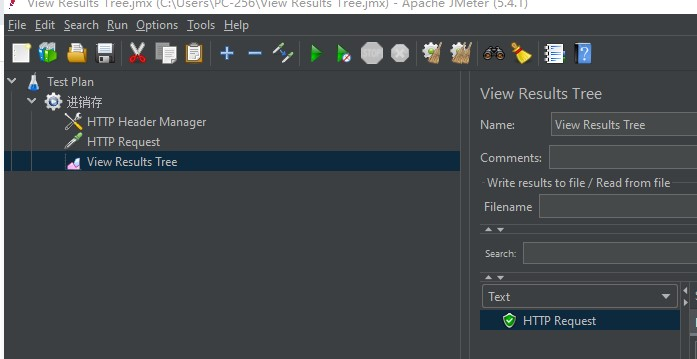

# JMeter windows环境安装运行

前置条件安装jdk

```
https://www.oracle.com/java/technologies/javase-jdk15-downloads.html
```

下载JMeter

```
https://jmeter.apache.org/download_jmeter.cgi

https://mirrors.bfsu.edu.cn/apache//jmeter/binaries/apache-jmeter-5.4.1.zip
```

运行

```
E:\app\apache-jmeter-5.4.1\bin\jmeter.bat
```



